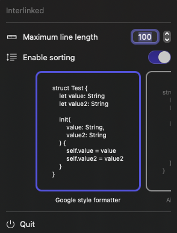

  
    
  

# Interlinked

Interlinked is an Xcode Source Extension that automatically keeps your initializer in sync with the state of your class/struct/actor variables. It provides a seamless way to generate initializer parameters and assignments, while preserving your existing code structure and initializer. It provides formatting options to customize the generated code to your preferences. 

#### Example Usage

  

#### Companion App

  

## Features

- **Parameter Injection and Assignments**: Seamlessly injects parameters and their respective assignments.
  
- **Smart Parameter Removal**: Automatically removes parameters and their assignments that don't correspond to any stored variable in the class/struct/actor.
 
- **Intelligent Property Handling**: Distinguishes which properties are settable, ensuring computed properties are left untouched.
  
- **Initializer Scope Awareness**: Recognizes values defined within the initializer's scope, even accommodating scenarios where a single locally-defined value might set multiple stored variables.
  
- **Scoped Value Comprehension**: Capable of understanding values defined in conditional scopes, such as within `if` statements.
  
- **Sorting Option for Parameters**: Provides an option to sort parameters and their assignments based on the order of variables in the class/struct/actor. This can be disabled for those who find it intrusive.
  
- **Cleanup of Unused Local Definitions**: Streamlines initializers by removing unused local variables, functions, structs, enums, classes, and actors defined within the initializer's scope.

- **Formatting Flexibility**: Offers three distinct formatting options for the initializer. Also provides an automatic line break feature when the line length exceeds a user-defined limit.

- **SwiftUI Attributes Handling**: Recognizes SwiftUI attributes and ensures they are correctly assigned in the initializer.
 
- **Code Block Selection**: Allows users to select a block of code and generate an initializer based on the selected class/struct/actor.

- **... And More!**: Continual improvements and features are in the works, ensuring the tool stays relevant and powerful.

## Limitations

- Interlinked does not currently support *Decodable* initializers. This is a planned feature for a future release.
- Interlinked attempts to maintain application logic, but it is not a seer and may not always generate the code you expect. Please review the generated code before committing it to your project.
- There may be bugs. Please report any issues you encounter.

## Contributing

We appreciate any contributions to improve Interlinked! If you'd like to contribute, please fork the repository and create a pull request with your changes. Make sure to include a detailed description of the changes and any additional steps necessary for testing.

## Reporting Issues

If you encounter any issues while using Interlinked, please report them by creating an issue on the GitHub repository. Be sure to include as much information as possible, such as the version of Xcode you are using, a description of the problem, and any relevant code snippets.

## License

Interlinked is released under the [MIT License](LICENSE).